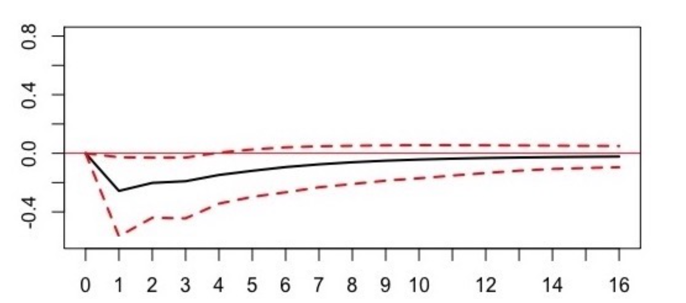

# Introduction

This repository contains R code for a Macroeconometrics (Bsc, Msc) course at the University of California - San Diego (UCSD).

The data used can be found in the 'data' folder and was extracted from [FRED](https://fred.stlouisfed.org/).

# Specifications on Files

## [A1_modelling_inflation_bj.R](https://github.com/nathaliemayor/Macroeconometrics/blob/main/A1_modelling_inflation_bj.R) / [A1_modelling_ur_bj.R](https://github.com/nathaliemayor/Macroeconometrics/blob/main/A1_modelling_ur_bj.R)

The code aims to find a time-series model that would best-fit the past values of the unemployment rate and inflation rate for the United-Kingdom. We follow the Box-Jenkins method (Box, G. and Jenkins, G. (1970))[[1]](#1) in order to obtain the best fitting model for the two data sets. We first analyze both data sets and identify for each one a class of simple autoregressive moving average process and select the model that describes best the data based on different criteria. Secondly, we  check the chosen model in order to verify our selection. 

Following the Box-Jenkins methodology, two models were selected to describe the unemployment and inflation rates in the United Kingdom. 
Concerning the unemployment rate, the chosen model was the second order autoregressive process (AR(2)) with the following parameters’ estimation : yt = φ1yt−1 +φ2yt−2+εt = 1.842yt−1 −0.850yt−1 +εt. 
Regarding the inflation rate, the selected model was the first order autoregressive moving average process ARMA(1,1) : yt = μ + φ1yt−1 + εt + θ1εt−1 = 4.746 + 0.807yt−1 + εt + 10.114εt−1.

## [A2_svar_modelling_gdp_ir.R](https://github.com/nathaliemayor/Macroeconometrics/blob/main/A2_svar_modelling_gdp_ir.R) : Assessing the Effectiveness of the Monetary Policy in the UK

(As of 13-Dec-2019) Central banks around the world have been loosening their monetary policies these last months, amid intensifying worries about low inflation, slowing global growth and a possible recession. As Brexit uncertainty continues to hang over England, its central bank is holding the monetary policy unchanged and the interest rates stable. However, the Brexit date is currently set for January 31, 2020, and the general concern is the existence or the absence of an agreed trade deal in order to start a new relationship with the European Union. Without this agreement, the country would have to face another extend transition period or to leave the European Union with a "no-deal". In such a hazardous environment, the objectives of the United Kingdom’s monetary policy is to use its tools in the most efficient way to face a declining growth and an increase in prices that leaving the EU without a deal would provoke. Indeed, an abrupt departure from the European Union would not allow businesses to have a transition period to adjust. Another concern regarding another delay is that it could lead to economic weakness. In this uncertain setting, the impact of the monetary policy on the economic activity represents an especially important concern. 

We analyse the impact of one of the tools used by the Bank of England, the policy interest rates, on the gross domestic product growth through empirical evidence. In order to address this concern we use the UK’s GDP and short-term interest rates time series data. We face the challenges brought by the fact that both data simultaneously cause each other by using a SVAR model. Indeed, this feature called "endogeneity bias" forbids us to use a traditional OLS regression. Thus, we will then use a solution proposed by Christopher A. Sims (1980) [[2]](#2) and apply it to our analysis in order to select and estimate a vector autoregression (VAR) process. 

Concerning the results : following the vector autoregression methodology, the selected process, based on the Bayesian information criterion and the Akaike information criterion was a second order VAR. The following two models were estimated to describe GDP growth and the nominal short-term interest rate in the United Kingdom :

**GDP Growth**: gt = 0.661 + 0.478 gt-1 + 0.256 gt-2 - 0.498 it-1 + 0.475 it-2 + &epsilon;gt

**Nominal Short-Term Interest Rate**: it = - 0.137 + 1.253 it-1 - 0.271 it-2 + 0.009 gt-1 + 0.071 gt-2 + &epsilon;it

  
| | 
|:--:| 
| *Impulse response of GDP growth (in %) from a positive shock (+1%) in the nominal short-term interest rate* |
  

# References

<a id="1">[1]</a> 
Box, G. and Jenkins, G. (1970) Time Series Analysis: Forecasting and Control. Holden-Day, San Francisco.

<a id="2">[2]</a> 
Sims, Christopher A. “Macroeconomics and Reality.” Econometrica 48, no. 1 (1980): 1–48. https://doi.org/10.2307/1912017.

